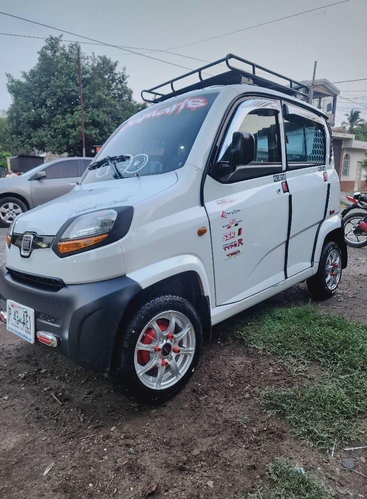
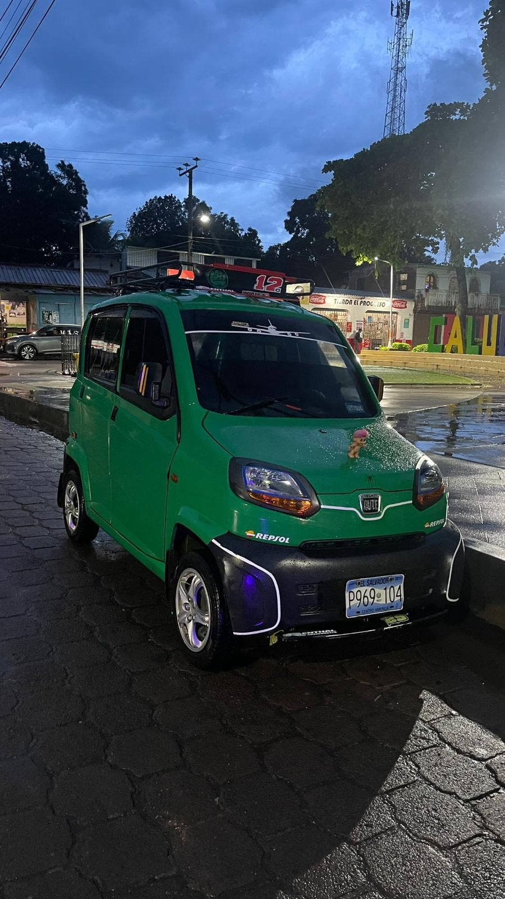
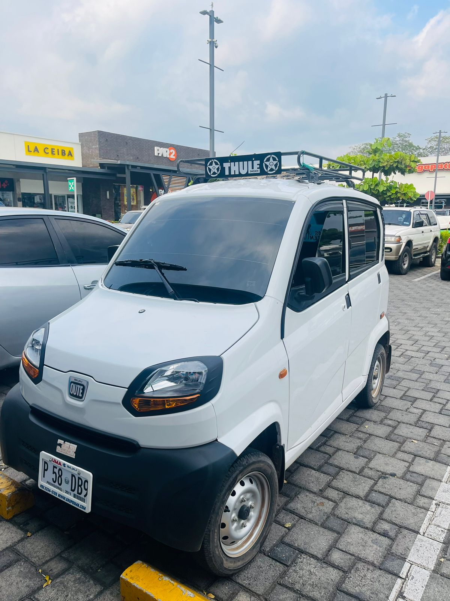

  

<body>
    <!--header section start -->
    

        

            

                

                    

                

                

                    

                        <ul>
                        <li><a href="index.html">INICIO</a></li>                                                    
                        <li><a href="https://wa.me/qr/UECKUOH36TMPB1">CONSULTAR</a></li>
                            <li><a href="https://wa.me/qr/UECKUOH36TMPB1">TAXI</a></li>
                            <li><a href="https://wa.me/qr/UECKUOH36TMPB1">RESERVAR</a></li>
                          
                            

                <a href="javascript:void(0)" class="closebtn" onclick="closeNav()">&times;</a>
                

                    <a href="index.html">INICIO</a>
                    <a href="https://wa.me/qr/UECKUOH36TMPB1">CONSULTAR</a>
                    <a href="https://wa.me/qr/UECKUOH36TMPB1">TAXI</a>
                  <a href="https://wa.me/qr/UECKUOH36TMPB1">RESERVAR</a>
                  <a href="https://wa.me/qr/UECKUOH36TMPB1">CONTACTAR</a>
                

                

          
              
                        </ul>
                    

            

        

    

    <!-- header section end -->
    <!-- banner section start -->
    

      

        

  

    

      

          

            

                <h1 class="book_text">NUMERO TEL:</h1>
                <h1 class="call_text">(+503) 7865-2329</h1>
            

            

          

          

              <h1 class="booking_text">RESERVA TU QUTE</h1>
            

            

              

                  <h2 class="request_text">VIVE UNA GRAN EXPERIENCIA</h2>
                <form action="/action_page.php">
                

                  <input type="text" class="email-bt" placeholder="PICKUP" name="Name">
                

                

                    <input type="text" class="email-bt" placeholder="QUTE" name="Email">
                

                

                    <input type="text" class="email-bt" placeholder="OTROS" name="Email">
                

                  </form>
                  
 
                  

    
<a href="#">BUSCAR</a>

          

          

        

    

    

      

          

            

                <h1 class="book_text">TAXI CALUCO</h1>
              <h1 class="call_text">EDUARDO FLORES</h1>
            

          

          

          

              <h1 class="booking_text">RESERVA TU QUTE</h1>
            

            

              

                  <h2 class="request_text">VIVE LA MEJOR EXPERIENCIA</h2>
                <form action="/action_page.php">
                

                  <input type="text" class="email-bt" placeholder="PICKUP" name="Name">
                

                

                    <input type="text" class="email-bt" placeholder="QUTE" name="Email">
                

                

                    <input type="text" class="email-bt" placeholder="OTRO" name="Email">
                

                  </form>
                  
 
                  

    
<a href="#">BUSCAR</a>

          

          

        

    

    

      

          

            

                <h1 class="book_text">TAXI CALUCO</h1>
                <h1 class="call_text">EDUARDO FLORS</h1>
            

          

          

          

              <h1 class="booking_text">RESERVA TU QUTE</h1>
            

            

              

                  <h2 class="request_text">VIAJA RAPIDO Y FELIZ</h2>
                <form action="/action_page.php">
                

                  <input type="text" class="email-bt" placeholder="PICKUP" name="Name">
                

                

                    <input type="text" class="email-bt" placeholder="QUTE" name="Email">
                

                

                    <input type="text" class="email-bt" placeholder="OTRO" name="Email">
                

                  </form>
                  
 
                  

    
<a href="#">BUSCAR</a>

          

          

        

    

  

<video width="400" height="250" controls>
     <source src="3.mp4" type="video/mp4">
       </video>

       <video width="400" height="250" controls>
        <source src="2.mp4" type="video/mp4">
       </video>
       <video width="400" height="250" controls>
       <source src="3.mp4" type="video/mp4">
       </video>

 

    <!-- Javascript files-->
    
    
    
    
    
    <!-- sidebar --1
    
    
    <!-- javascript --> 
    
    
     
      
 

